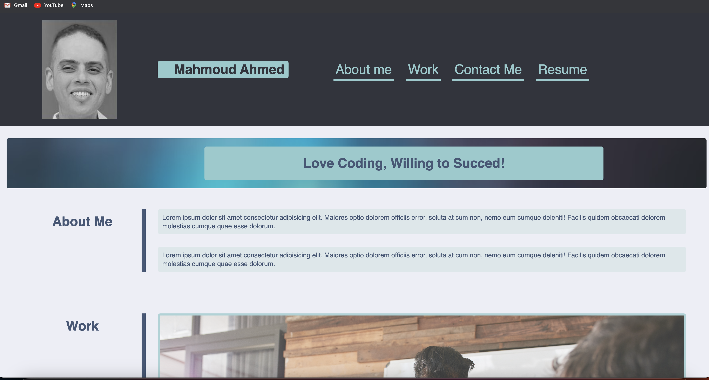

# 02 Advanced CSS: Portfolio

# My Portfolio

## Description

create a web application from scratch to build a portfolio page, which I can add to as the course progresses.

## Installation

What are the steps required to install your project? Provide a step-by-step description of how to get the development environment running.
1-Build HTML page
2-Style the Page generaly
3-Add the links
4-Go specifically with each element to style and add Transitions
5-work on media queries to have a good responsive

## Usage

Included screenshots shows the usage and the deployed URL.

